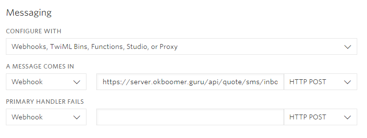
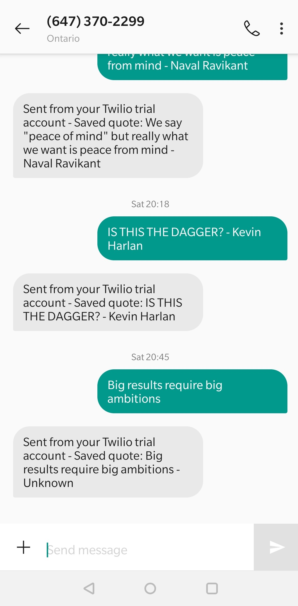
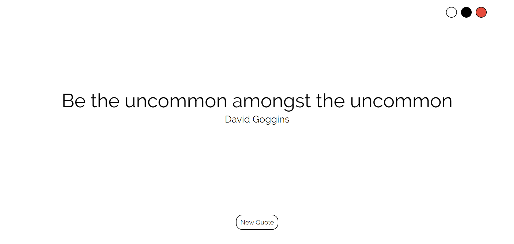
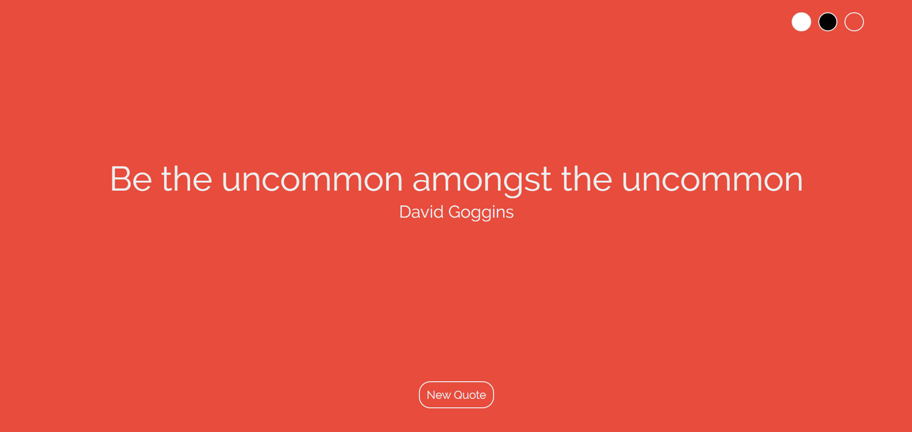

# okboomer.guru
A collection of my favourite quotes.

### Demo
https://okboomer.guru/

### Installation
Clone this repo to your machine and run `npm install` on both the `client` directory, and the `server` directory

`https://github.com/radihuq/okboomer.git`

### Technologies
This project uses:
* ReactJS
* Node.js
* MongoDB
* Express
* Axios
* Twilio Programmable SMS API

### Usage
This application makes use of the Twilio Programmable SMS API to save received text messages into the database. [Follow this tutorial](https://www.twilio.com/docs/sms/tutorials/how-to-receive-and-reply-node-js) to set up your Twilio account if you do not already have an SMS number and a Twilio Webhook set up.

You will also need to create a `.env` file in the `client`, and `server` directory with the following parameters:

##### ./client/.env
    PORT=
    REACT_APP_SERVER=

##### ./server/.env
    SERVER_PORT=
    DB_CONNECTION=
    TWILIO_ACCOUNT_SID=
    TWILIO_AUTH_TOKEN=

### Screenshots

*Twilio Console - Webhook Linked*

*Confirmation that the texted quote was saved to database*

*Example of a quote displayed on web application*

*Change the theme by clicking one of the circles on the top-right*

### Author
This project was created by Radiun Huq. You can reach him at:

**Email**: radi@mrhuq.com

**Twitter**: [@radiunhuq](https://twitter.com/radiunhuq)